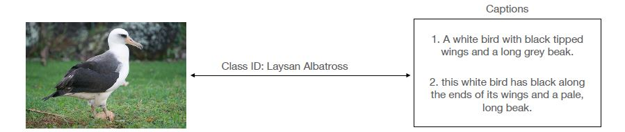
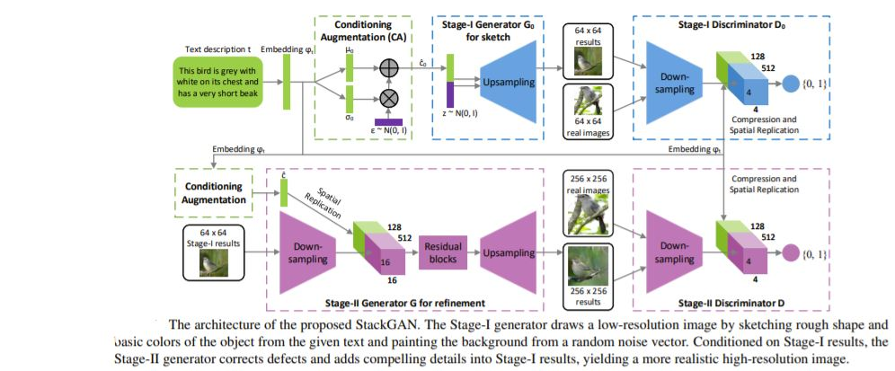
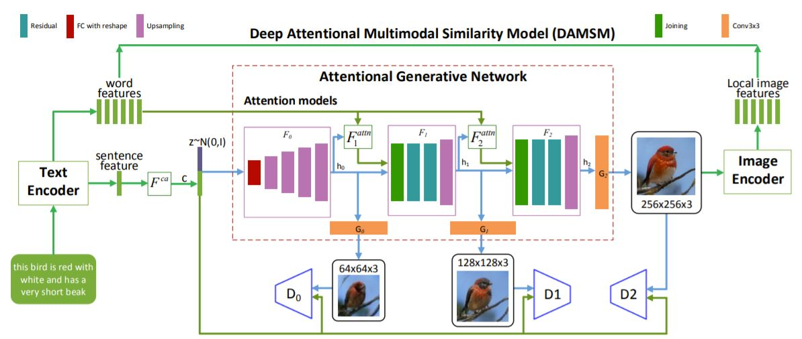
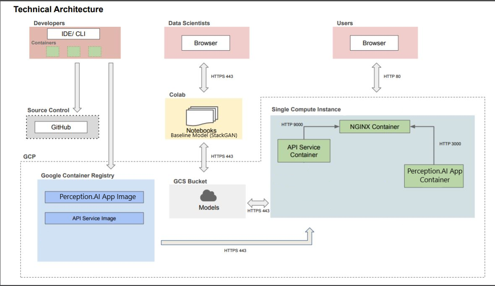
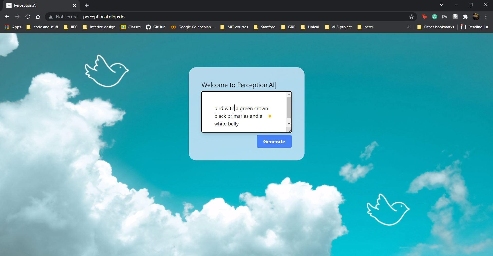
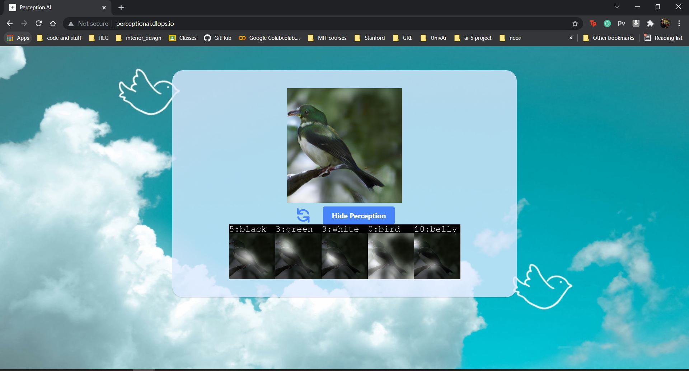

# Perception.AI

Perception.AI is a text-to-image project, in which Stack GAN has been implemented from scratch. It takes in image caption as an input, and the GAN model generates a corresponding image. This is a collaborative project by [Anshika Gupta](https://github.com/iamanshika), [HarshVardhan Goyal](https://github.com/HarshVardhanGoyal), [Meghana Sarikonda](https://github.com/meghanasarikonda), and [Vishnu M](https://github.com/vishnu701).

Link to medium article: https://medium.com/@Anshika-Gupta/perception-ai-9630359e42dd

## Introduction

Automatic synthesis of realistic images from text would be interesting and useful, and we could witness some AI systems in recent years such as GAN-INT-CLS, which is an RNN encoder with GAN decoder that came out in 2016 was the first paper to propose the Idea of text to image using generative adversarial modeling. However, in recent years generic and powerful recurrent neural network architectures have been developed to learn discriminative text feature representations. Meanwhile, deep convolutional generative adversarial networks (GANs) have begun to generate highly compelling images of specific categories, such as faces, album covers, and room interiors, such as GAWWN, StackGANs, etc.

## Goal

In this project, we propose to implement a text-to-image adversarial generative model that allows attention-driven, multi-stage refinement for fine-grained text-to-image generation. 

There is a serious predicament of class imbalance in Artificial Intelligence and with Perception.AI, we aim to solve this problem by generating images for rare classes which otherwise occur infrequently, or not at all.

## Dataset

We used the [Caltech-UCSD Birds 200](http://www.vision.caltech.edu/visipedia/CUB-200.html) (CUB-200) dataset. It is an image dataset with photos of 200 bird species (mostly North American).

With approximately 12 thousand images and one bounding box per image for object detection, it also has 10 captions corresponding to each image.

## Approach

We took **StackGAN** as our `baseline model` and implemented it from scratch. Read paper [here](https://arxiv.org/pdf/1612.03242v1.pdf).

A setback about StackGANs is that only a single sentence embedding is used as an input therefore there is no word-level association between the sentence and the image.
Therefore, we researched further and switched to **AttnGAN** for an improved model. Read paper [here](https://arxiv.org/pdf/1711.10485.pdf).

With a novel attentional generative network, the **AttnGAN** can synthesize fine-grained details at different subregions of the image by paying attention to the relevant words in the natural language description. In addition, a deep attentional multimodal similarity model is proposed to compute a fine-grained image-text matching loss for training the generator.

## Deployment of the application

We deployed our model on the web. Here is the technical architecture:

The user can enter the description of a bird in the text box, that the user wants an image of. Our model generates a corresponding image of the bird description as provided by the user.

Here is an example:

The user inputs a bird description, and hits the generate button.

Voila! Our model generates the desired image.

## Results and Findings

The proposed AttnGAN significantly outperforms the previous state-of-the-art, boosting the best-reported inception score by 14.14% on the CUB dataset. It shows that the layered attentional GAN is able to automatically select the condition at the word level for generating different parts of the image. The experimental results show that, compared to previous state-of-the-art approaches, the AttnGAN is more effective for generating complex scenes due to its novel attention mechanism that catches fine-grained word level and sub-region level information in text-to-image generation.
